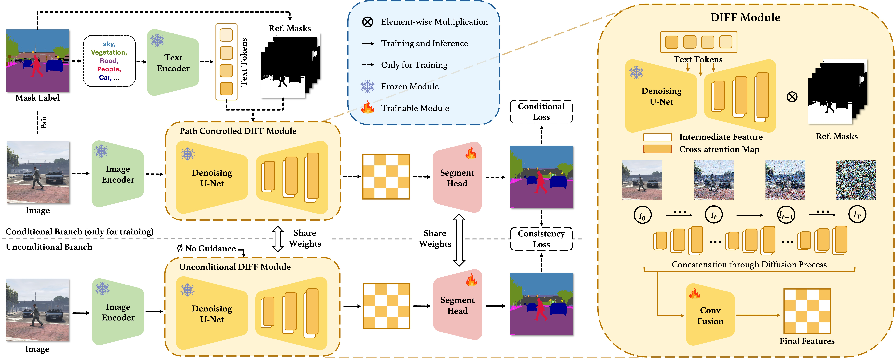

## Diffusion Features to Bridge Domain Gap for Semantic Segmentation

**by [Yuxiang Ji*](https://yux1angji.github.io/), Boyong He\*, [Chenyuan Qu](), Zhuoyue Tan, Chuan Qin, Liaoni Wu**


## Overview

Pre-trained diffusion models have demonstrated remarkable proficiency in synthesizing images across a wide range of scenarios with customizable prompts, indicating their effective capacity to capture universal features. 
Motivated by this, our study delves into the utilization of the implicit knowledge embedded within diffusion models to address challenges in cross-domain semantic segmentation. 
This paper investigates the approach that leverages the sampling and fusion techniques to harness the features of diffusion models efficiently. 
We propose DIffusion Feature Fusion (DIFF) as a backbone use for extracting and integrating effective semantic representations through the diffusion process.
By leveraging the strength of text-to-image generation capability, we introduce a new training framework designed to implicitly learn posterior knowledge from it.

Relying on diffusion-based encoder, our approach improves
the previous state-of-the-art performance by 2.7 mIoU for GTA→Cityscapes,
by 4.98 mIoU for GTA→ACDC, by 11.69 mIoU for GTA→Dark Zurich.



[[arXiv]](https://arxiv.org/abs/2406.00777)

## Setup Environment

For this project, we used python 3.8.18. We recommend setting up a new virtual
environment:

```shell
python -m venv ~/venv/diff
source ~/venv/diff/bin/activate
```

In that environment, the requirements can be installed with:

```shell
pip install -r requirements.txt -f https://download.pytorch.org/whl/torch_stable.html
pip install mmcv-full==1.3.7  # requires the other packages to be installed first
```

Further, please download the Stable-Diffusion v2-1 weights from HuggingFace. 
Please refer to the instruction at [Stable-Diffusion](https://huggingface.co/stabilityai/stable-diffusion-2-1).


All experiments were executed on a NVIDIA RTX A6000.

## Setup Datasets

**Cityscapes:** Please, download leftImg8bit_trainvaltest.zip and
gt_trainvaltest.zip from [here](https://www.cityscapes-dataset.com/downloads/)
and extract them to `data/cityscapes`.

**GTA:** Please, download all image and label packages from
[here](https://download.visinf.tu-darmstadt.de/data/from_games/) and extract
them to `data/gta`.

More details of dataset preparation could be referred at [DAFormer](https://github.com/lhoyer/DAFormer).


## Training

To run a simple experiment on GTA→Cityscapes

```shell
python run_experiments.py --exp 50
```

More information about the available configuration and experiments, can be
found in [stridehyperfeature.yaml](mmseg/models/backbones/diff/configs/stridehyperfeature.yaml).


## Acknowledgements

This project is based on the following open-source projects. We thank their
authors for making the source code publically available.

* [MMSegmentation](https://github.com/open-mmlab/mmsegmentation)
* [DAFormer](https://github.com/lhoyer/DAFormer)
* [Diffusion-HyperFeature](https://github.com/diffusion-hyperfeatures/diffusion_hyperfeatures)
* [VPD](https://github.com/wl-zhao/VPD)

